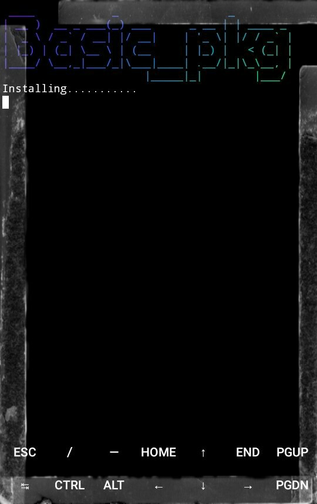

# Version: 1.2

# Installation Termux
     apt update && apt upgrade -y
     apt install git ruby figlet -y
     gem install lolcat
     git clone https://github.com/DilumBBandara/Basic_pkg.git
     cd Basic_pkg
     bash basic_pkg.sh

<html>
<body>

   

</body>
</html>
